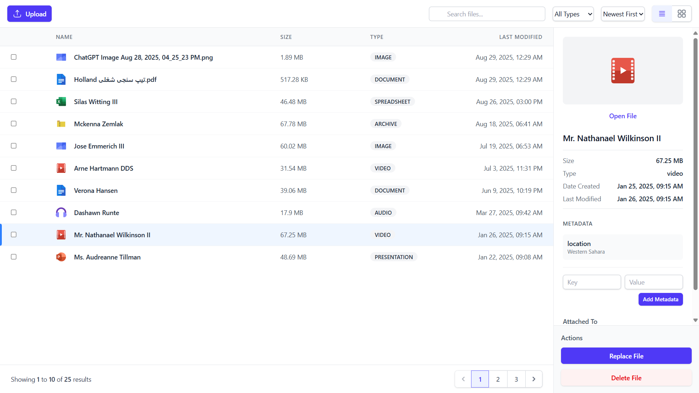

# File Manager


A modern, responsive file management interface built with React and TypeScript. Features drag-and-drop uploads, multiple view modes, file metadata management, and advanced filtering capabilities.



## Features

- **Dual View Modes**: Switch between list and grid views
- **Drag & Drop Upload**: Intuitive file uploading with queue management
- **Advanced Filtering**: Search, sort, and filter by file type
- **Metadata Management**: Add, edit, and delete custom file metadata
- **File Preview**: Image thumbnails and detailed file information
- **Batch Operations**: Select multiple files for bulk actions
- **Responsive Design**: Works seamlessly across desktop and mobile devices

## Tech Stack

- **Frontend**: React 18 with TypeScript
- **Styling**: Tailwind CSS
- **Icons**: Lucide React
- **State Management**: Zustand (assumed from store usage)
- **Backend**: Laravel (API endpoints)

## Component Architecture

The application is built with a modular component architecture:

```
src/
├── components/
│   ├── FileManager.tsx        # Main container component
│   ├── Toolbar.tsx           # Search, filters, and actions
│   ├── FileListView.tsx      # Table view for files
│   ├── FileGridView.tsx      # Grid view with thumbnails
│   ├── Sidebar.tsx           # File details and actions
│   ├── MetadataEditor.tsx    # Metadata management
│   ├── UploadModal.tsx       # File upload interface
│   └── Pagination.tsx        # Navigation controls
└── utils/
    └── fileUtils.ts          # Utility functions
```

## Key Features

### File Operations
- Upload files via drag-and-drop or file picker
- Replace existing files
- Delete individual or multiple files
- Preview images inline

### Organization
- Search files by name
- Filter by file type (images, videos, documents, etc.)
- Sort by date, size, or name
- Paginated results for large file collections

### Metadata Management
- Add custom key-value metadata to files
- Edit existing metadata inline
- Delete metadata entries
- View file relationships and attachments

## File Structure

Each component handles a specific responsibility:
- **FileManager**: Orchestrates the entire interface
- **Toolbar**: Handles user actions and filtering
- **Views**: Separate components for list and grid displays
- **Sidebar**: Manages file details and metadata
- **Upload**: Handles file upload workflow

This modular approach ensures maintainability and makes it easy to extend functionality or modify individual features without affecting the entire application.
